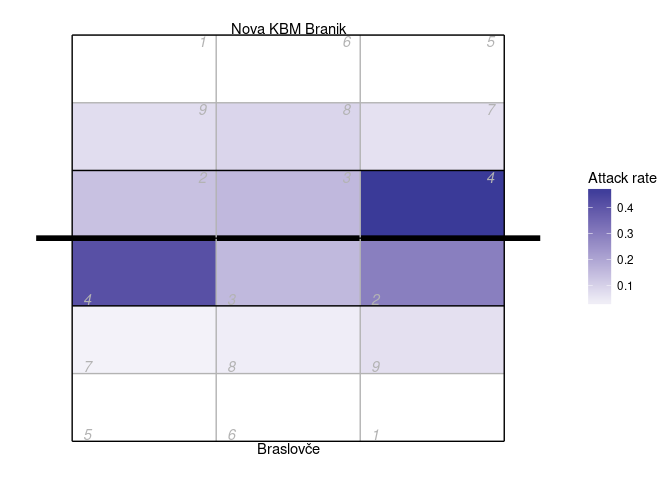
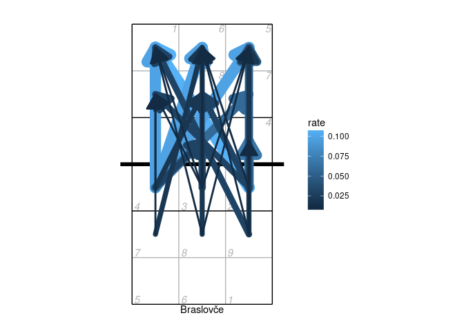
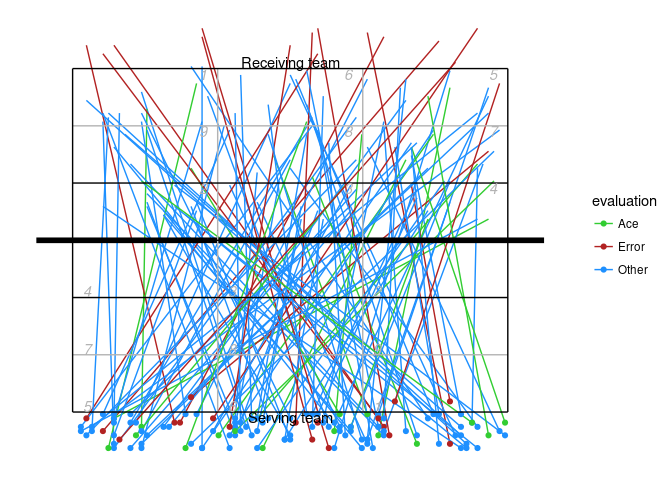

<!-- README.md is generated from README.Rmd. Please edit that file -->

# datavolley

[](https://travis-ci.org/raymondben/datavolley)

An R package for reading DataVolley scouting files.

See also this [DataVolley file
validator](https://apps.untan.gl/dvalidate/), which is built on the
datavolley package.

## Installation

``` r
library(devtools)
install_github("raymondben/datavolley")
```

## Example

Read one of the example data files bundled with the package:

``` r
library(datavolley)
x <- read_dv(dv_example_file(), insert_technical_timeouts=FALSE)
summary(x)
#> Match summary:
#> Date: 2015-01-25
#> League: Finale mladinke
#> Teams: Braslovče (JERONČIČ ZORAN/MIHALINEC DAMIJANA)
#>        vs
#>        Nova KBM Branik (HAFNER MATJAŽ/)
#> Result: 3-0 (25-16, 25-14, 25-22)
#> Duration: 67 minutes
```

Number of serves by team:

``` r
serve_idx <- find_serves(plays(x))
table(plays(x)$team[serve_idx])
#> 
#>       Braslovče Nova KBM Branik 
#>              74              54
```

Distribution of serve run lengths:

``` r
serve_run_info <- find_runs(plays(x)[serve_idx,])
table(unique(serve_run_info[,c("run_id","run_length")])$run_length)
#> 
#>  1  2  3  4  5  7  8 
#> 34 16  7  4  1  1  1
```

The court position associated with each action can be recorded in two
ways. The most common is by zones (numbered 1-9).

Heatmap of attack rate by court zone:

``` r
library(ggplot2)
library(dplyr)
#> 
#> Attaching package: 'dplyr'
#> The following objects are masked from 'package:stats':
#> 
#>     filter, lag
#> The following objects are masked from 'package:base':
#> 
#>     intersect, setdiff, setequal, union
## calculate attack frequency by zone, per team
attack_rate <- plays(x) %>% dplyr::filter(skill=="Attack") %>%
    group_by(team, start_zone) %>% dplyr::summarize(n_attacks=n()) %>%
    mutate(rate=n_attacks/sum(n_attacks)) %>% ungroup

## add x,y coordinates associated with the zones
attack_rate <- cbind(attack_rate, dv_xy(attack_rate$start_zone, end="lower"))

## for team 2, these need to be on the top half of the diagram
tm2i <- attack_rate$team==teams(x)[2]
attack_rate[tm2i, c("x", "y")] <- dv_flip_xy(attack_rate[tm2i, c("x", "y")])

ggplot(attack_rate, aes(x, y, fill=rate)) + geom_tile() + ggcourt(labels=teams(x)) +
    scale_fill_gradient2(name="Attack rate")
```

<!-- -->

Or using arrows to show the starting and ending zones of attacks:

``` r
## first tabulate attacks by starting and ending zone
attack_rate <- plays(x) %>% dplyr::filter(team==teams(x)[1] & skill=="Attack") %>%
  group_by(start_zone, end_zone) %>% tally() %>% ungroup

## convert counts to rates
attack_rate$rate <- attack_rate$n/sum(attack_rate$n)

## discard zones with zero attacks or missing location information
attack_rate <- attack_rate %>% dplyr::filter(rate>0 & !is.na(start_zone) & !is.na(end_zone))

## add starting x,y coordinates
attack_rate <- cbind(attack_rate, dv_xy(attack_rate$start_zone, end="lower", xynames=c("sx","sy")))

## and ending x,y coordinates
attack_rate <- cbind(attack_rate, dv_xy(attack_rate$end_zone, end="upper", xynames=c("ex","ey")))

## plot in reverse order so largest arrows are on the bottom
attack_rate <- attack_rate %>% dplyr::arrange(desc(rate))

p <- ggplot(attack_rate,aes(x,y,col=rate)) + ggcourt(labels=c(teams(x)[1],""))
for (n in 1:nrow(attack_rate))
    p <- p + geom_path(data=data.frame(x=c(attack_rate$sx[n], attack_rate$ex[n]),
                                       y=c(attack_rate$sy[n],attack_rate$ey[n]),
                                       rate=attack_rate$rate[n]),
        aes(size=rate), lineend="round", arrow=arrow(ends="last", type="closed"))
p + scale_fill_gradient(name="Attack rate") + guides(size="none")
```

<!-- -->

The second source of position data is court coordinates. These are not
included in all data files, because generally they must be manually
entered by the scout and this can be a time consuming process. For the
purposes of demonstration, here we generate fake coordinate data:

``` r
## take just the serves from the play-by-play data
xserves <- subset(plays(x), skill=="Serve")

## if the file had been scouted with coordinate included, we could plot them directly
## this file has no coordinates, so we'll fake some up for demo purposes
coords <- dv_fake_coordinates("serve", xserves$evaluation)
xserves[, c("start_coordinate", "start_coordinate_x", "start_coordinate_y",
            "end_coordinate", "end_coordinate_x", "end_coordinate_y")] <- coords

## now we can plot these
xserves$evaluation[!xserves$evaluation %in% c("Ace", "Error")] <- "Other"

ggplot(xserves, aes(start_coordinate_x, start_coordinate_y,
       xend=end_coordinate_x, yend=end_coordinate_y, colour=evaluation))+
    geom_segment() + geom_point() +
    scale_colour_manual(values=c(Ace="limegreen", Error="firebrick", Other="dodgerblue")) +
    ggcourt(labels=c("Serving team", "Receiving team"))
```

<!-- -->

## Troubleshooting

If you see unexpected behaviour, try `read_dv(...,do_warn=TRUE)` to
obtain more diagnostic information during the process of reading and
parsing the DataVolley file. Also check the text encoding specified to
`read_dv` (did you specify one??)

## More

For more information about DataVolley, see
<http://www.dataproject.com/IT/en/Volleyball>.
